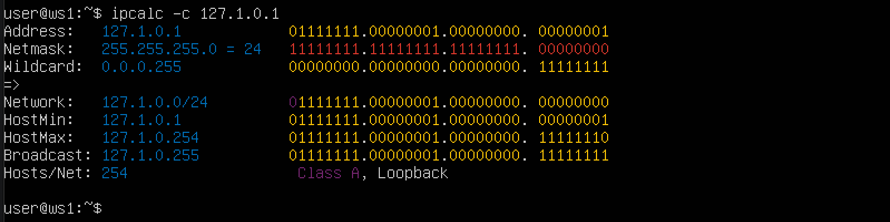
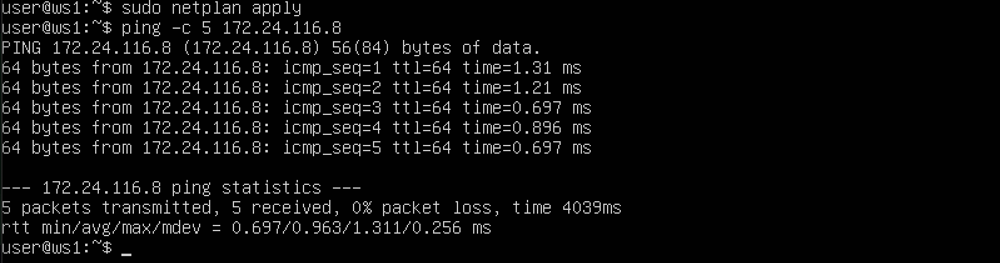
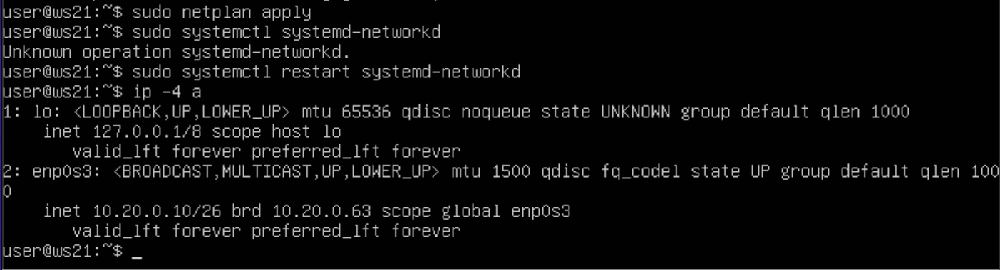
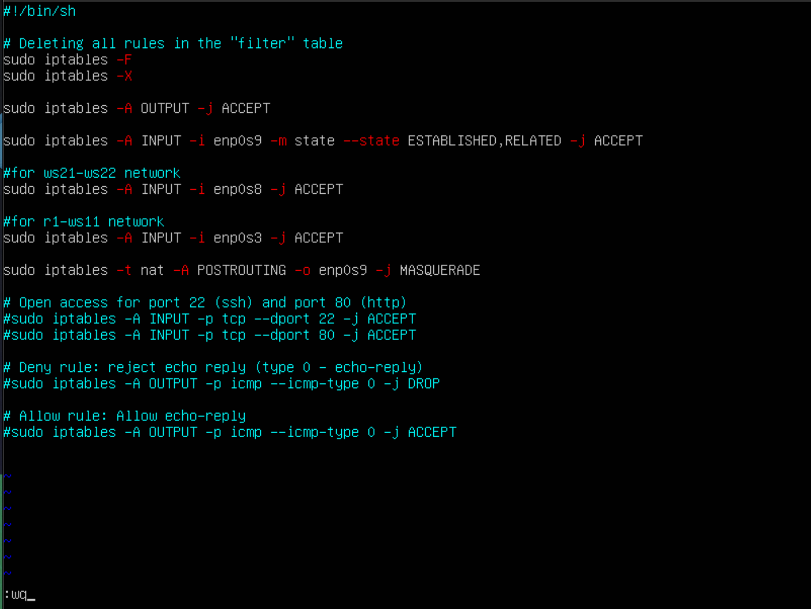
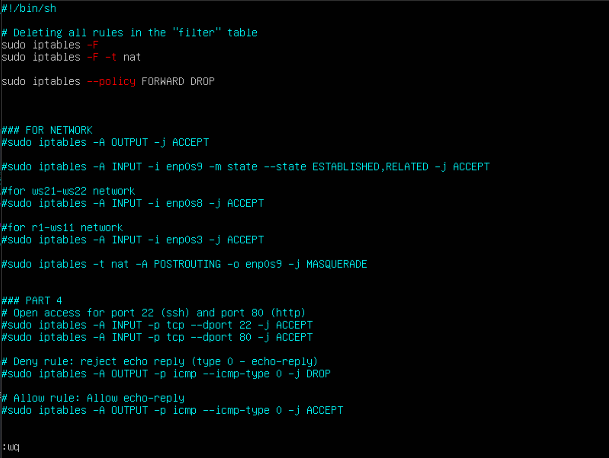

# Сети в Linux

## Content

1. [Инструмент ipcalc](#Part_1)
2. [Статическая маршрутизация между двумя машинами](#Part_2)
3. [Утилита iperf3](#Part_3)
4. [Сетевой экран](#Part_4)
5. [Статическая маршрутизация сети](#Part_5)
6. [Динамическая настройка IP с помощью DHCP](#Part_6)
7. [NAT](#Part_7)
8. [Знакомство с SSH Tunels](#Part_8_bonus)


## 1. Инструмент ipcalc<a name="Part_1"></a>

Поднимаем виртуальную машину ws1

#### 1.1 Сети и маски
##### Устанавливаем утилиту **ipcalc** командой: `sudo apt install ipcalc`

##### 1) Адрес сети *192.167.38.54/14*

  

  * Адрес сети: **192.167.35.54**

##### 2.1) Перевод маски *255.255.255.0* в префиксную и двоичную записи

  

  * Маска в префиксной записи: **/24**
  * Маска в двоичной записи: **11111111.11111111.11111111.00000000**

##### 2.2) Перевод маски */15* в обычную и двоичную записи

  

  * В обычной записи: **24**
  * В двоичной записи: **11111111.11111111.11111111.00000000**

##### 2.3) Перевод маски *11111111.11111111.11111111.11110000* в обычную и префиксную записи

  

  * В обычной записи: **255.255.255.240**
  * В префиксной записи: **/28**

  >*Для просмотра информации о маске вбиваем любой адрес сети (192.192.0.0).*

  >*Префиксная запись означает количество единиц в битовых полях маски, считая с левого края*

##### 3) Определить минимальный и максимальный хост в сети *12.167.38.4* при масках:

  * */8*:

    

    * Host min: **12.0.0.1**
    * Host max: **12.255.255.254**

  * *11111111.11111111.00000000.00000000*:

    

    * Host min: **12.167.0.1**
    * Host max: **12.167.255.254**

  * *255.255.254.0*:

    

    * Host min: **12.167.38.1**
    * Host max: **12.167.39.254**

  * */4*:

    

    * Host min: **0.0.0.1**
    * Host max: **15.255.255.254**

#### 1.2 localhost

  Определяем можно ли обратиться к приложению, работающему на localhost, со следующими IP:

  * *194.34.23.100*:

    

    * Нельзя, тк адрес не относится к localhost

  * *127.0.0.2*:

    

    * Можно, тк адрес относится к loopback

  * *127.1.0.1*:

    

    * Можно, тк адрес относится к loopback

  * *128.0.0.1*:

    

    * Нельзя, тк адрес не относится к localhost

#### 1.3 Диапазоны и сегменты сетей
##### 1) Какие из перечисленных IP можно использовать в качестве публичного, а какие только в качестве частных: *10.0.0.45*, *134.43.0.2*, *192.168.4.2*, *172.20.250.4*, *172.0.2.1*, *192.172.0.1*, *172.68.0.2*, *172.16.255.255*, *10.10.10.10*, *192.169.168.1*

  * Публичные: *134.43.0.2*, *172.0.2.1*, *192.172.0.1*, *172.68.0.2*, *192.169.168.1*

  * Частные: *10.0.0.45*, *192.168.4.2*, *172.20.250.4*, *172.16.255.255*, *10.10.10.10*

##### 2) Какие из перечисленных IP-адресов шлюза возможны у сети *10.10.0.0/18*: *10.0.0.1*, *10.10.0.2*, *10.10.10.10*, *10.10.100.1*, *10.10.1.255*

  
    
    * Адрес: **10.10.0.0**
    * Маска: **255.255.192.0**
    * Диапазон хостов: **10.10.0.1** - **10.10.63.254**
    * Бродкастный адрес: **10.10.63.255** (IP-адрес, который используется для отправки пакетов всеми устройствами в одной локальной сети)

  * Возможные IP-адреса шлюза заданной сети: *10.10.0.2*, *10.10.10.10*, *10.10.1.255*

## 2. Статическая маршрутизация между двумя машинами<a name="Part_2"></a>

##### Поднимаем вторую виртуальную машину **ws2** и меняем сетевые интерфейсы на внутреннюю сеть с названием <*itnet1*>

##### С помощью команды `ip a` смотрим существующие сетевые интерфейсы обеих машин

  * ws1:

  

  * ws2:

  

* У обеих машин присутствуют 2 сетевых интерфейса: 
  1) *lo* - Loopback интерфейс, для обращения машин к себе же
  2) *enp0s3* - сетевой интерфейс, для отправки/получения данных из сети

##### Задаем следующие адреса и маски:
  
  * ws1 — *192.168.100.10*, маска */16*

    
    
  * ws2 — *172.24.116.8*, маска */12*

    

##### Выполняем команду `netplan apply` для перезапуска сервиса сети

  * ws1:

    

  * ws2:

    

#### 2.1 Добавление статического маршрута вручную

##### Переключаем сетевые адаптеры обеих машин с *NAT* на *internal network* c названием **intnet1**

##### Добавляем статический маршрут от одной машины до другой и обратно при помощи команды вида `ip r add`. И пингуем соединение между машинами

* ws1:

  

* ws2:

  

#### 2.2 Добавление статического маршрута с сохранением

##### Перезапускаем машины командой `sudo reboot`

##### Добавляем статический маршрут от одной машины до другой с помощью файла */etc/netplan/00-installer-config.yaml*

* ws1:

  

* ws2:

  

##### Пингуем соединение с обеих машин

* ws1 -> ws2:

  

* ws2 -> ws1:

  

## 3. Утилита **iperf3**<a name="Part_3"></a>

#### 3.1 Скорость соединения

##### Переводим: 8 Mbps в MB/s, 100 MB/s в Kbps, 1 Gbps в Mbps.

* 8Mbps = 1 MB/s

* 100 MB/s = 800000 kbps

* 1 Gbps = 1000 Mbps

#### 3.2. Утилита **iperf3**

##### Измеряем скорость соединения между ws1 и ws2

Запускаем ws1 в качестве сервера, ws2 в качестве клиента:


## 4. Сетевой экран<a name="Part_4"></a>

#### 4.1. Утилита **iptables**

##### Создаем файл */etc/firewall.sh*, имитирующий файрвол, на ws1 и ws2:

Для этого пишем следующую команду: `sudo touch /etc/firewall.sh`

##### Редактируем файлы согласно заданию:

* ws1:

  

* ws2: 

  

##### Запускаем файлы на обеих машинах командами `chmod +x /etc/firewall.sh` и `/etc/firewall.sh` и проверяем правила через команду `iptables -L`

* ws1:

  

* ws2:

  

> В обоих файлах firewall.sh на обеих машинах прописан флаг *-j --jump* (Определяет цель правила; т.е., что делать, когда пакет попадает под условия правила. Если эта опция не задана в правиле (и ключ -g также не использован), то правило не будет применяться, но счётчик количества применений правила будет увеличен) => каждое правило срабатывает, как только соблюдаются условия.

>На первой машине сначала прописаны запрещающие правила, затем разрешающие. На второй машине наоборот: сначала разрешающие, затем запрещающие

>Таким образом, при пинговании машин должна пинговаться машина ws2, а машиина ws1 пинговаться не будет

#### 4.2. Утилита **nmap**

##### Командой **ping** проверяем машину ws1, которая не должна «пинговаться», после чего утилитой **nmap** покажем, что хост машины запущен.

* Пинг машин:

  * ws1:

    

  * ws2:

    

* Вывод `nmap` с ws2:

  

## Part 5. Статическая маршрутизация сети<a name="Part_5"></a>

#### Поднимаем пять виртуальных машин (3 рабочие станции (ws11, ws21, ws22) и 2 роутера (r1, r2)), согласно схеме


#### 5.1. Настройка адресов машин

##### Настраиваем конфигурации машин в *etc/netplan/00-installer-config.yaml* согласно сети на рисунке.

* содержание файла *etc/netplan/00-installer-config.yaml* для ws11:

  

* содержание файла *etc/netplan/00-installer-config.yaml* для r1:

  

* содержание файла *etc/netplan/00-installer-config.yaml* для r2:

  

* содержание файла *etc/netplan/00-installer-config.yaml* для ws21:

  

* содержание файла *etc/netplan/00-installer-config.yaml* для ws22:

  

##### Перезапускаем сервис сети командой `sudo systemctl restart systemd-networkd`. Командой `ip -4 a` проверяем, что адреса машин заданы верно. 

* ws11:

  

* r1:

  

* r2:

  

* ws21:

  

* ws22:

  

##### Также пропингуем ws22 с ws21. Аналогично пропингуем r1 с ws11.

* Пинг **ws22 -> ws21**:

  

* Пинг **r1 -> ws11**:

  

#### 5.2. Включение переадресации IP-адресов

##### Для включения переадресации IP выполняем команду на роутерах:

`sysctl -w net.ipv4.ip_forward=1`

*При таком подходе переадресация не будет работать после перезагрузки системы.*

* ws11:

  

* r1:

  

* r2:

  

* ws21:

  

* ws22:

  

##### Открываем файл */etc/sysctl.conf* и добавляем в него следующую строку:

`net.ipv4.ip_forward = 1`

*При использовании этого подхода, IP-переадресация включена на постоянной основе.*

* ws11:

  

* r1:

  

* r2:

  

* ws21:

  

* ws22:

  

#### 5.3. Установка маршрута по умолчанию

##### Настраиваем маршрут по умолчанию (шлюз) для рабочих станций. Для этого добавляем `default` перед IP-роутера в файле конфигураций.

* ws11:
  

* ws21:
  

* ws22:
  

##### Вызоваем `ip r`, для того чтобы показать, что добавился маршрут в таблицу маршрутизации.

* ws11:
  

* ws21:
  

* ws22:
  

##### Пропингуем с ws11 роутер r2 и покажем на r2, что пинг доходит. Для этого используем команду: `tcpdump -tn -i enp0s3`

* Вывод с ws1:

  

* Вывод с r2:

  

  >Пинг с ws11 доходит до r2, но поскольку r2 неизвестно, куда возвращать пакеты, они не возвращаются назад, о чем сообщает результаты команды *ping* "0 received, 100% lost"

#### 5.4. Добавление статических маршрутов

##### Добавляем в роутеры r1 и r2 статические маршруты в файле конфигураций.

* r1:

  

* r2:

  

##### Вызываем `ip r` для просмотра таблицы с маршрутами на обоих роутерах.

* r1:

  

* r2:

  

##### Запускаем команды на ws11:

`ip r list 10.10.0.0/[маска сети]` и `ip r list 0.0.0.0/0`

  

> Выбор маршрута 10.10.0.0/18 вместо 0.0.0.0/0 обусловлен его большей спецификой и потенциально меньшей метрикой. Это позволяет системе более эффективно маршрутизировать трафик внутри локальных сетей, избегая ненужного обращения к маршруту по умолчанию для внутренних адресов

#### 5.5. Построение списка маршрутизаторов

##### Запустим на r1 команду дампа:

`tcpdump -tnv -i eth0`

##### При помощи утилиты **traceroute** построем список маршрутизаторов на пути от ws11 до ws21

* Вывод tcpdump на r1:

  

* Построенный список маршрутизаторов ws11 -> ws21:

  

  > Traceroute отправляет эхо-пакеты с увеличивающимся TTL. TTL - Time To Live, время жизни пакета. Время жизни пакета уменьшается после прохождения им каждого узла в сети. Если отправить пакет с TTL 1, то он упрется в первый узел (роутер r1) и тот вернет ответ: TTL exceeded, что значит "время жизни истекло". Из его ответа можно вытащить ip_src и таким образом узнать IP-адрес первого узла. Взяв TTL 2, можно узнать IP-адрес второго узла и т.д.

#### 5.6. Использование протокола **ICMP** при маршрутизации

##### Запустим на r1 перехват сетевого трафика, проходящего через eтp0s3 с помощью команды:

`tcpdump -n -i eth0 icmp`

##### Пропингуем с ws11 несуществующий IP (*10.30.0.111*) с помощью команды:

`ping -c 1 10.30.0.111`

* r1:

  

* ws11:

  

## Part 6. Динамическая настройка IP с помощью **DHCP**<a name="Part_6"></a>

##### Для загрузки нужных пакетов **DHCP** создадим выход во внешнюю сеть через r2

1) Добавляем третий адаптер на r2 (NAT адаптер)

  

2) Изменяем файлы конфигураций на r1 и r2

  * r1:

  

  * r2:

  

3) Настраиваем файл *firewall.sh*, добавляя правила для внутреннего NAT

  

  > Без настройки фаервола отправленные пакеты будут возвращаться на ip-адрес r2 и теряться на нем, не доходя до целевой машины. При заданных настройках, внутренний NAT сам перешлёт ответ на машину, отправившую запрос

4) Проверяем соединение командой ping с машины ws11 на адрес 8.8.8.8

  

5) Загружаем необходимые пакеты на r2

##### Для r2 настраиваем в файле */etc/dhcp/dhcpd.conf* конфигурацию службы **DHCP**:

##### 1) Указываем адрес маршрутизатора по умолчанию, DNS-сервер и адрес внутренней сети


##### 2) В файле *resolv.conf* прописываем `nameserver 8.8.8.8`


##### Перезагружаем службу **DHCP** командой `systemctl restart isc-dhcp-server`


##### Поскольку теперь в сети есть DHCP-сервер, изменяем нетпланы машин ws1 и ws2

  * ws21:

  

  * ws22:

  

##### Машину ws21 перезагружфаем при помощи `reboot` и через `ip a` показываем, что она получила адрес. 


> Теперь у ws21 (также как и у ws22) есть 2 ip-адреса: статический и динамический (через DHCP)

##### Также пропингуем ws22 с ws21.


##### Для r1 настраиваем аналогично r2, но сделаем выдачу адресов с жесткой привязкой к MAC-адресу (ws11). Проводим аналогичные тесты

* Для скачивания необходимых пакетов прописываем в *resolve.conf* на r1 `nameserver 8.8.8.8` и скачиваем командой `apt-get install isc-dhcp-server`

##### Настраиваем нетплан у ws11

  

##### Для r1 настраиваем в файле */etc/dhcp/dhcpd.conf* конфигурацию службы **DHCP**:

##### 1) Указываем адрес маршрутизатора по умолчанию, DNS-сервер и адрес внутренней сети

  

##### 2) В файле *resolv.conf* у r1 проверяем запись `nameserver 8.8.8.8`

  

##### Перезагружаем службу **DHCP** командой `systemctl restart isc-dhcp-server`

  

##### Перезагружаем ws11 вводом команды `reboot`

  * Вывод команды `ip a`:

  

##### Пропингуем оба адреса ws21 (статический и динамический) с ws11


##### Запросим с ws21 обновление IP-адреса

* до

  

* после

  

> Для освобождения ip-адреса используем команду `sudo dhclient -r enp0s3` (Флаг -r явно освобождает адрес и после этого клиент завершает работу). Затем с помощью DHCP получаем свежий IP-адрес

## Part 7. **NAT**<a name="Part_7"></a>

##### В файле */etc/apache2/ports.conf* на ws22 и r1 изменим строку `Listen 80` на `Listen 0.0.0.0:80`, то есть сделаем сервер Apache2 общедоступным.

* r1:

  

* ws22:

  

##### Запускаем веб-сервер Apache командой `service apache2 start` на ws22 и r1.

* r1:

  

* ws22:

  

##### Добавим в фаервол на r2 следующие правила:

##### 1) Удаление правил в таблице filter — `iptables -F`;
##### 2) Удаление правил в таблице «NAT» — `iptables -F -t nat`;
##### 3) Отбрасывать все маршрутизируемые пакеты — `iptables --policy FORWARD DROP`



##### Запускаем фаерволл командами `chmod +x /etc/firewall.sh` и `sh /etc/firewall.sh`

##### Проверяем соединение между ws22 и r1 командой `ping`.

* r1:

  

* ws22:

  

##### Добавим в файл ещё одно правило:

##### 4) Разрешить маршрутизацию всех пакетов протокола **ICMP**.


##### Запускаем фаерволл командой `sh /etc/firewall.sh`

##### Проверяем соединение между ws22 и r1 командой `ping`.

* r1:

  

* ws22:

  

##### Добавим в файл ещё два правила:

##### 5) Включим **SNAT**, а именно маскирование всех локальных IPиз локальной сети, находящейся за r2 (по обозначениям из Части 5 — сеть 10.20.0.0).

##### 6) Включим **DNAT** на 8080 порт машины r2 и добавить к веб-серверу Apache, запущенному на ws22, доступ извне сети.


##### Запустим фаервол на r2

> Перед запуском файла отключаем 3-ий сетевой адаптер r2 на VB с NAT-выходом во внешнюю сеть

```
sh /etc/firewall.sh
```

##### Проверим соединение по TCP для **SNAT**: для этого с ws22 подключимся к серверу Apache на r1 командой:
`telnet [адрес] [порт]`


##### Проверим соединение по TCP для **DNAT**: для этого с r1 подключимся к серверу Apache на ws22 командой `telnet` (обращаемся по адресу r2 и порту 8080).


## Part 8. Дополнительно. Знакомство с **SSH Tunnels**<a name="Part_8_bonus"></a>

> Для выполнения задания необходимо наличие openssh-server

##### Запусти веб-сервер **Apache** на ws22 только на localhost (то есть в файле */etc/apache2/ports.conf* измени строку `Listen 80` на `Listen localhost:80`).

* Измененный файл */etc/apache2/ports.conf* на ws22:

  

* Запуск сервера apache на ws22:

  

##### Воспользуемся *Local TCP forwarding* с ws21 до ws22, чтобы получить доступ к веб-серверу на ws22 с ws21.

```
ssh -L 8080:localhost:80 10.20.0.20
```

* Вывод с ws21 (первая вкладка):

  

  

* Проверка с ws21 (второй терминал):

  

##### Воспользуемся *Remote TCP forwarding* c ws11 до ws22, чтобы получить доступ к веб-серверу на ws22 с ws11.

```
ssh -R 8080:localhost:80 10.0.0.2
```

* Вывод с ws22 (первая вкладка):

  

  

* Проверка с ws11:

  
